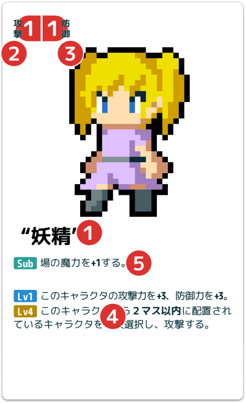
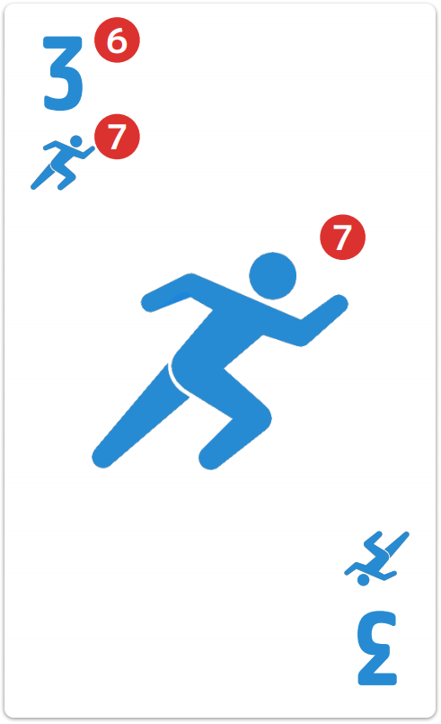
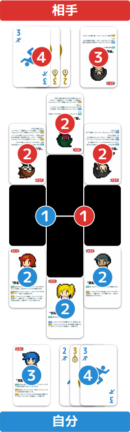

デストロイゼムオール！！！
######

========== ========== ========
プレイ人数 プレイ時間 対象年齢
========== ========== ========
2人        15～30分   12歳以上
========== ========== ========

ゲームの概要
******

目的
======

プレイヤーがそれぞれのキャラクタを戦わせ、勝利を目指します。

勝利条件
======

* フィールド上の相手のキャラクタをすべてダウン、またはゲームから除外する。
* 相手が降参する。

セット内容
******

================ ==========
キャラクタカード 行動カード
================ ==========
20枚(10種類 * 2) 20枚(10種類 * 2)
================ ==========

セットには含みませんが、6面ダイスが必要となります。少なくとも5個程度あるのが望ましいです。

カード説明
******

キャラクタカード
======

#. 名前
    * キャラクタの名前です。
#. 攻撃力
    * キャラクタの攻撃の強さです。
#. 防御力
    * キャラクタの防御の強さです。
#. 技能
    * キャラクタの持つ特殊能力です。
    * *場の魔力がLv以上* でなければ、その技能は使用できません。
    * *Lvの枠が青色* の技能は、キャラクタが表向きでフィールドに配置されており、場の魔力がLv以上の場合、技能の効果が継続的に適用されます。
#. サブ技能
    * サブキャラクタの時のみ参照される特殊能力です。
    * 特に記述のない限り、効果が継続的に適用されます。

行動カード
======

#. 値
    * 行動の優先度、または魔力量です。
    * 行動フェイズの使用時には、 *行動の優先度* として扱います。切札は *優先度が最も高い* ものとして扱います。
    * 行動フェイズで自分と相手が使用した行動カードの値の合計値は、その *次の行動フェイズの場の魔力* となります。切札の *場の魔力は0* として扱います。
#. 種類
    * 行動の種類です。
    * 移動(青)・攻撃(赤)・技能(黄)・切札(★)の4種類があります。

場・射程
******

場
======

#. フィールド
    * キャラクタを戦わせる場所です。
    * 3マス、4マス、3マスの三列、計10マスで構成されています。
    * 一つのマスには、1枚のキャラクタまでしか存在できません。既にキャラクタが存在するマスに対して、別のキャラクタが移動することはできません。
#. 初期位置
    * ゲーム開始時、キャラクタを配置するマスです。
    * フィールド中、端から自分よりの3マスがそれぞれのプレイヤーの初期位置です。
#. サブ置き場
    * サブキャラクタを配置する場所です。
    * サブ置き場はフィールドに含まれず、明記されていない限り、攻撃や技能の対象になりません。
#. 使用済み行動カード
    * 行動フェイズに使用した行動カードです。 *枚数と種類、値が常に見えるようにして下さい。*

射程
======

通常、 *攻撃と技能は隣接しているマス・キャラクタを対象* とします。しかし、技能によっては離れたマスまでを対象にすることができる場合があります。

離れた特定のマスまでを対象に選ぶことができるものは、 *「このキャラクタからXマス以内に配置されているキャラクタを選択し〜」* と記述され、Xには数値が入ります。このXの数値分、離れたマスのキャラクタを対象にできます。

*「フィールド上に配置されたキャラクタから1枚選択し、〜」* と記述されている技能は、対象をフィールドから自由に選択できます。

ゲームの流れ
******

準備
======

#. すべてのカードを1種類ずつ、各プレイヤーに配ります。それらを手札とします。
#. 配られたキャラクタカードから、4枚使用するものを選択します。選択しなかったキャラクタカードは、ゲームから除外します。
#. 選択したキャラクタカードを *フィールド* に **3枚** と *サブ置き場* に **1枚** 、配置します。
#. すべてのキャラクタカードの配置後、それらを表向きにします。

ラウンドの進行
======

ゲームはラウンドを繰り返して進行します。

ラウンドには複数のフェイズがあり、以下の順番に進めます。

#. 開始フェイズ
#. 行動フェイズ
#. 終了フェイズ

行動フェイズは *1ラウンドに1～5回* 繰り返します。すべてのプレイヤーが行動フェイズのパスを宣言した場合、以降の行動フェイズをスキップし、終了フェイズに移行します。

いずれかのプレイヤーがゲームの勝利条件を満たした時点で、ゲームを終了します。

開始フェイズ
******

ラウンドの開始です。以下の項目を順に実行します。

#. ダウン状態のキャラクタに蓄積されたダメージを *1点* 回復します。
#. ダメージのないキャラクタのダウンを解消し、表向きにします。

行動フェイズ
======

キャラクタを行動させます。

以下の項目を順に実行します。

#. 直前の行動フェイズで使用された *すべての行動カードの値の合計値を、この行動フェイズの場の魔力* にします。ラウンド最初の行動フェイズの場合、場の魔力は *1* となります。
#. 手札から使用したい行動カードを選択し、自分の前に裏向きに配置します。
#. すべてのプレイヤーの前に配置された行動カードを、同時に表向きにします。
#. 行動カードの値の大きいプレイヤーから、行動カードを使用します。
    #. 行動カードの値が *同じ* だった場合、その行動フェイズは *キャラクタに行動させず* に終了します。
    #. 行動カードが *切札* の場合、その相手の行動カードは *使用できません* 。
#. 行動カードで行動させるキャラクタを選択し、行動させます。

すべての項目実行後、その行動フェイズを終了させ、次の行動フェイズ、または終了フェイズに移行します。

行動フェイズは1ラウンドに最大5回まで繰り返します。

行動の種類
======

行動は移動、攻撃、技能の3種類があります。キャラクタの行動には、その種類の同じ行動カードが1枚必要になります。

*切札はどの種類の行動にも使用できます* 。

移動
  キャラクタを1マス移動させます。
  自分の他のキャラクタが配置されているマスに移動する場合、そのキャラクタと移動させたいキャラクタの配置を入れ替えます。
技能
  キャラクタの技能を一つ使用します。
  同じ技能は1ラウンドに1回だけ使用できます。
攻撃
  キャラクタに別のキャラクタを攻撃させます。
  各キャラクタは1ラウンドに1回だけ攻撃できます。

終了フェイズ
******

ラウンドの終了です。以下の項目を順に実行します。

#. 「使用したラウンド中」と記載のある効果を終了させます。
#. このラウンドで使用した行動カードをすべて手札に戻します。

完了後、そのラウンドを終了し、次のラウンドの開始フェイズに移行します。

戦闘
******

攻撃とダメージ
======

キャラクタが他のキャラクタを攻撃する場合、以下の項目を順に実行し、ダメージを決定します。

#. 攻撃側のプレイヤーは、攻撃したキャラクタの攻撃力の数、ダイスを振ります。一の目が出た数＋1を *攻撃判定値* とします。
#. 攻撃された側のプレイヤーは、攻撃されたキャラクタの防御力の数、ダイスを振ります。一の目が出た数を *防御判定値* とします。 *攻撃力・防御力が0*のキャラクタは、 *ダイスを振らずに各判定値が0* になります。
#. 攻撃判定値から防御判定値を引いた値を *ダメージ値* とします。一度の攻撃のダメージ値が *5点以上* の場合、攻撃されたキャラクタはゲームから除外します。
#. 攻撃されたキャラクタに決定したダメージ値分のダメージを蓄積します。

ダウン
======

ダメージが *3点以上* 蓄積されたキャラクタは *ダウン状態* となり、裏向きに配置します。ダウンしているキャラクタは、以下の性質を備えます。

* 移動以外の行動が行えません。
* 攻撃された場合、攻撃判定値やダメージ値を問わず、ゲームから除外します。
* 技能により、1点以上のダメージを受けた場合、ゲームから除外します。

ダウンは、 *開始フェイズの終了時* にそのキャラクタに蓄積されたダメージが0点である場合に解消され、表向きに戻します。

ゲームから除外
======

キャラクタは、ゲームから除外されることがあります。

ゲームから除外されたキャラクタは、そのゲーム中は使用できません。

最初に選ばなかったキャラクタとともに、場から離れた位置に置き、使用しているカードと混ざらないようにしてください。

FAQ
******

Q: ダメージがないキャラクタに3点より大きいダメージを与えた場合、そのキャラクタをゲームから除外する？
  A: 3点か4点の場合はしません。そのキャラクタは受けたダメージを蓄積してダウンします。5点以上の場合、ゲームから除外します。
Q: ダメージが1点蓄積され、ダウンしているキャラクタに1点以上のダメージを与えた場合、そのキャラクタをゲームから除外する？
  A: します。
Q: 場の魔力が0より小さくなる場合、Lv0の技能は使用できない？
  A: 場の魔力の下限は0で、マイナスにはなりません。
Q: 行動フェイズで、行動カードを表向きにした後で、キャラクタを行動できない、またはさせたくない場合、どのようにする？
  A: 行動させないことを相手に宣言することで、キャラクタを行動させずに先に進めます。
Q: 行動フェイズで、使用する行動カードが二人とも切札だった場合はどうなる？
  A: 値が同じだった場合と同じく、その行動フェイズは終了となります。
Q: 自分が“光刃”をサブキャラクタとして使用している場合、行動フェイズで、使用する行動カードが二人とも切札だった場合はどうなる？
  A: 自分だけ切札を使用してキャラクタを行動させることができます。
Q: 自分と相手が”光刃”をサブキャラクタとして使用している場合、行動フェイズで、使用する行動カードが二人とも同じだった場合はどうなる？
  A: 通常と同じく、その行動フェイズは終了となります。
Q: 攻撃力、防御力、場の魔力を増減する場合の計算順は？
  A: 値を増加する効果を先に計算します。
Q: “鉄拳”のサブ技能の攻撃力と防御力の増加は、他の技能による増減とどちらを先に計算する？
  A: “鉄拳”のサブ技能を先に計算します。“妖精”が“鉄拳”のサブ技能の対象となり場の魔力が1以上の場合、攻撃力/防御力は、1/1→2/2→5/5となります。
